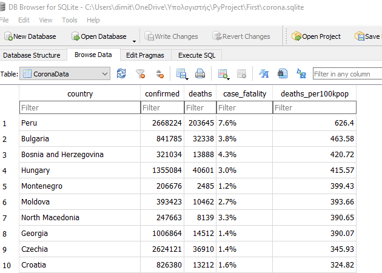
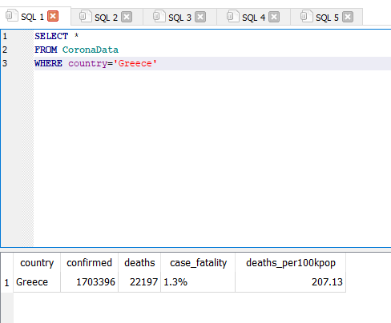
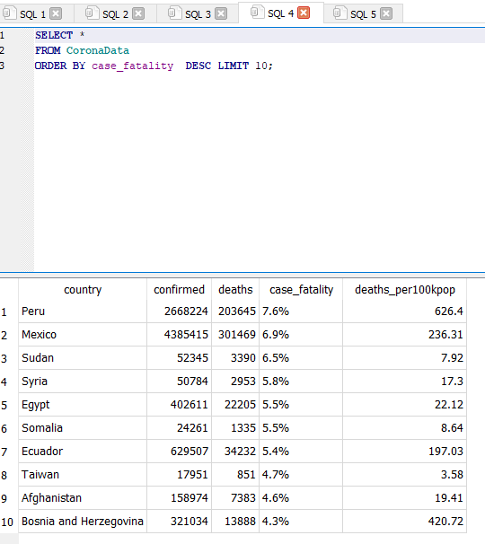
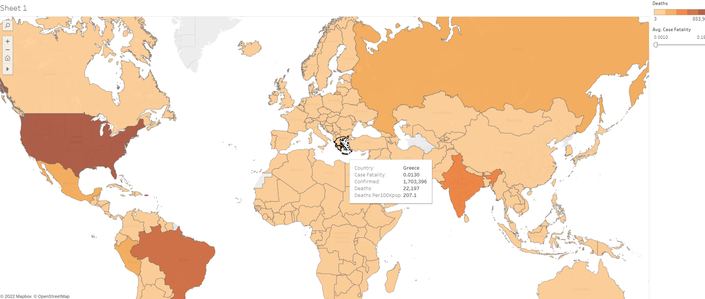
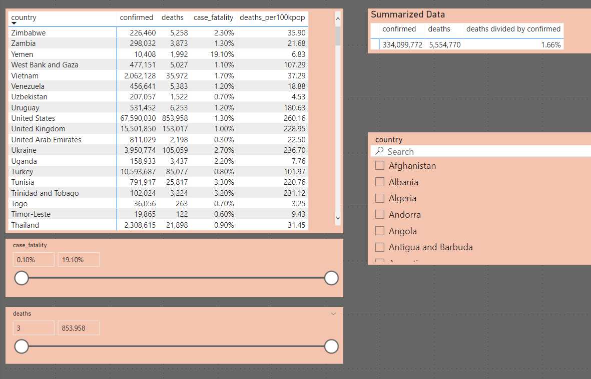

# Web-Scraping-with-Python
## Global COVID-19 Data

## Project overview
This project focuses on gathering global COVID-19 data. I developed Python scripts to scrape data from the Johns Hopkins University Coronavirus Resource Center (https://coronavirus.jhu.edu/data/mortality). The scraped data was then stored in a SQLite database, and finally visualized using Tableau.

Tools Used: Python, SQLite, Tableau, and Power BI

## Python Code
Libraries: BeautifulSoup, Re, Urllib, Sqlite3.  
The process involved the following steps:  
1. Website Connection: urllib.request was used to establish a connection to the target website.
2. HTML Parsing: BeautifulSoup was used to parse the HTML content, allowing for the identification and targeting of specific HTML tags containing the desired data.
3. Data Extraction: Regular expressions (re) were used to extract the relevant text strings from within the targeted HTML tags.
4. Database Integration: The sqlite3 library was used to create SQLite database tables. A for loop was implemented to iterate through the extracted data and insert it into the database.

### Main Script: Corona.py
The main Python script (`corona.py`) scrapes COVID-19 mortality data and stores it in a SQLite database.

### Project Structure
```
Python Code/
├── Corona.py      # Main scraper (production)
├── letsgo2.py     # Development - HTML structure exploration
├── letsgo3.py     # Development - Regex pattern testing
└── re10.py        # Development - Quick regex tests
```

### Data Extracted
| Field | Description |
|-------|-------------|
| Country | Country name |
| Confirmed | Total confirmed cases |
| Deaths | Total deaths |
| Case Fatality | Percentage of deaths among confirmed cases |
| Deaths per 100k | Deaths per 100,000 population |

### Usage
```bash
cd "Python Code"
python Corona.py
```

The Python Code folder also contains:
Additional Python scripts developed during the project, which were incorporated into the final corona.py script.
The SQLite database files generated during the process.
A CSV file exported from the SQLite database, used for data visualization in Tableau.

## SQLite
The data was last updated on January 19, 2022. Here's a look at the resulting tables created automatically in SQLite after running the Python script.



Then I ran some simple queries.





I saved the data in .csv format to connect with Tableau, because at the moment Tableau public doesn't support sqlite files. You can access the sql table, queries and csv file using the same folder used for the python code above!

## Tableau
Finally, I saved the data in CSV format for use with Tableau. Currently, Tableau Public does not support direct connections to SQLite files. You can find the SQL tables, queries, and the CSV file within the same folder as the Python code.  




## PowerBI
Finally, I imported the data into Power BI and created a report featuring a map, detailed tables, and interactive slicers.


## License
MIT License


